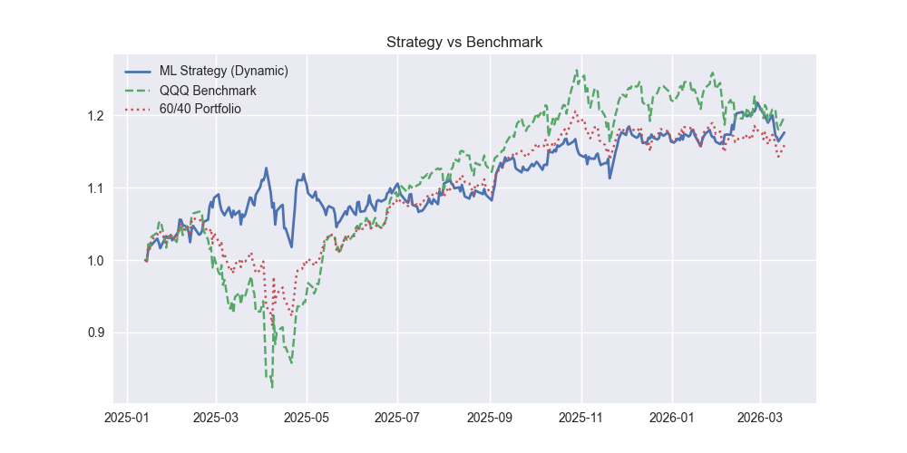

# ML-Regime-Switching-Strategy 

## 🎓 Personal Reflections & Growth

This project stems from my passion for **Quantitative Finance** and my coursework in **Financial Mathematics**. As a sophomore, I wanted to bridge the gap between classroom theory (like market efficiency and risk metrics) and real-world algorithmic trading.

### My Journey:
* **Academic Foundation:** I applied mathematical concepts learned in class to define market volatility regimes and risk-adjusted returns.
* **Human-AI Collaboration:** While I utilized AI tools to assist with complex coding structures and debugging, the core strategy logic, feature selection, and the critical "Signal Smoothing" innovation were driven by my own analysis of market noise.
* **The Learning Curve:** This project taught me that quantitative trading is not just about high returns, but more about managing biases and understanding the trade-offs between sensitivity and stability.

## 👨‍🎓 Project Abstract
This project was developed during my **sophomore year** to explore how Machine Learning can identify market risk regimes. It dynamically allocates assets between **QQQ (Nasdaq 100)** and **TLT (Treasury Bonds)** based on volatility predictions from a Random Forest model.

## 💡 Key Improvements (Innovation)
I focused on moving beyond theoretical backtesting to address real-world trading challenges:
* **Noise Reduction**: Implemented a **5-day signal smoothing filter** to minimize over-trading and slippage costs. This optimization improved the Sharpe Ratio from **0.61 to 1.04**.
* **Integrity First**: Enforced a strict **T+1 execution lag** and accounted for **5bps transaction fees** to eliminate look-ahead bias and ensure realistic performance.

## 📊 Backtest Performance
| Metric | Result |
| :--- | :--- |
| **Sharpe Ratio** | **1.102** |
| **Max Drawdown** | **-9.697%** |
| **Out-of-Sample Return** | **17.576%** |

### Performance Visualization

## 🛠️ Tech Stack
* **Language**: Python
* **Library**: Scikit-Learn (Random Forest), Pandas, Numpy, Matplotlib，Yfinance
* **Metrics**: Sharpe Ratio, Max Drawdown, Regime Probability

### What's Next?
I am committed to deepening my knowledge in **Stochastic Calculus** and **Machine Learning**. This is just the beginning of my journey to design more robust, sophisticated, and market-adaptive financial systems.
---
*Disclaimer: For academic purposes only. Not financial advice.*
